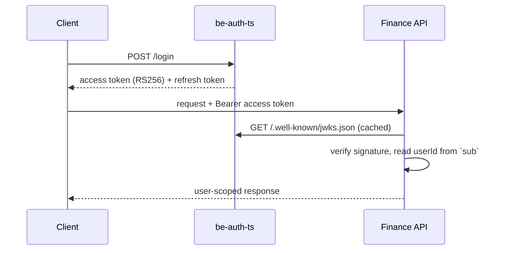

# be-auth-ts

Standalone **authentication service** for FinTrack. It issues short-lived **RS256 JWTs**, manages refresh tokens, and publishes a **JWKS** endpoint so other services can verify tokens without calling back.


Part of [FinTrack Labs](https://github.com/fintrack-labs), a personal learning project on distributed backend design.

## Why a separate auth service?

Separating identity from business logic means the finance API never touches passwords or private keys. It only trusts tokens it can verify against a public key set, which keeps the trust boundary small and explicit.

## Features

- User registration and login (email + password, plus client credentials)
- **RS256 access tokens**, about one hour expiry, with a key ID (`kid`)
- **Refresh tokens stored only as SHA-256 hashes**; supports logout and revocation
- **JWKS endpoint** at `/.well-known/jwks.json` for local verification by other services
- Data model for users, clients, groups, user-group assignments, and refresh tokens (Prisma)

## API

Default prefix: `/auth/api` (port `8081`).

| Method | Path | Description |
| --- | --- | --- |
| `POST` | `/user/register` | Create a user |
| `POST` | `/login` | Authenticate, receive access + refresh tokens |
| `POST` | `/refresh-token` | Exchange a valid refresh token for a new token pair |
| `POST` | `/logout` | Revoke the refresh token |
| `GET` | `/.well-known/jwks.json` | Public keys for token verification |

A ready-to-run request collection is in [`be-api-client-test`](https://github.com/fintrack-labs/be-api-client-test).

## How token verification works



## Tech stack

Node.js · TypeScript · Fastify · Prisma · PostgreSQL

## Getting started

Prerequisites: Node.js (LTS) and a PostgreSQL database.

```bash
git clone https://github.com/fintrack-labs/be-auth-ts.git
cd be-auth-ts
npm install
cp .env.example .env      # set DATABASE_URL and other values
npx prisma migrate dev    # create the schema
npm run dev
```

<!-- TODO: samakan perintah & nama variabel dengan package.json dan .env.example -->

On first start, signing keys are generated if none exist.

## Known limitations & roadmap

- **Key lifecycle:** keys are generated at startup when absent. Production needs durable key storage and rotation, with old public keys kept in JWKS until existing tokens expire.
- **CORS:** currently permissive; should be restricted to the real frontend origin per environment.
- **Rate limiting** and brute-force protection on `/login` are not implemented yet.
- Token claims (issuer `fintrack-be-auth`, audience) should be enforced consistently by every consumer.

## Related repositories

[`fe-web`](https://github.com/fintrack-labs/fe-web) · [`be-node-ts`](https://github.com/fintrack-labs/be-node-ts) · [`be-ai-ocr-service`](https://github.com/fintrack-labs/be-ai-ocr-service) · [`be-api-client-test`](https://github.com/fintrack-labs/be-api-client-test)
